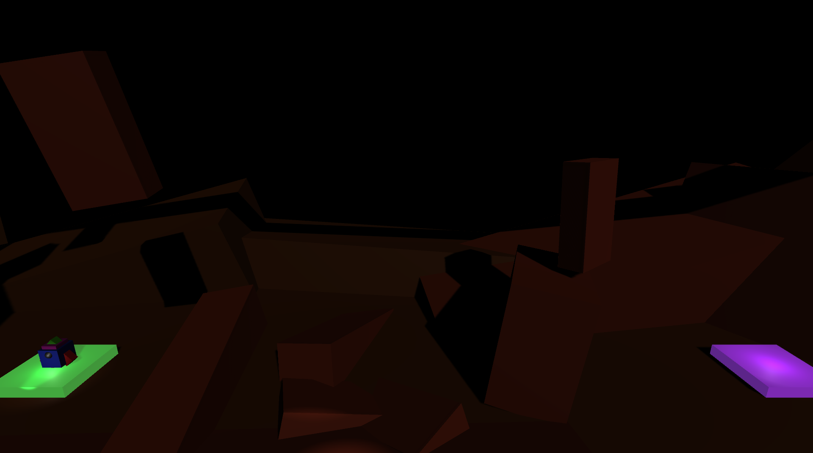
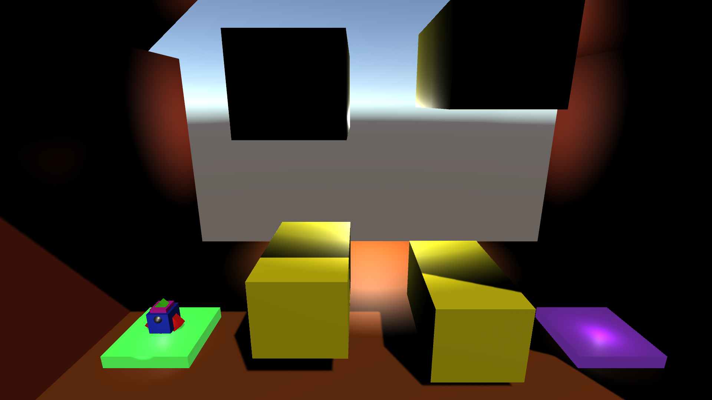
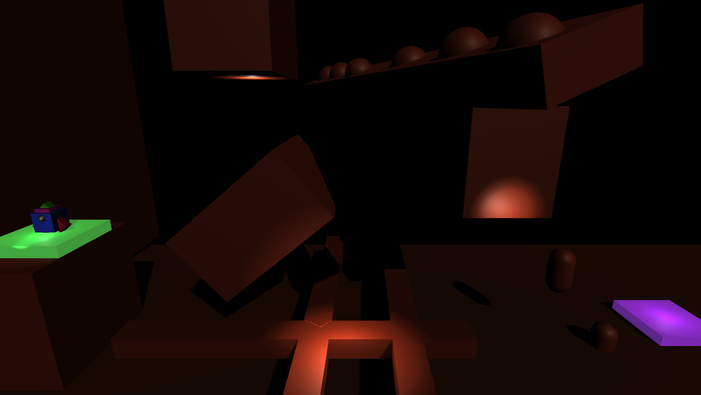
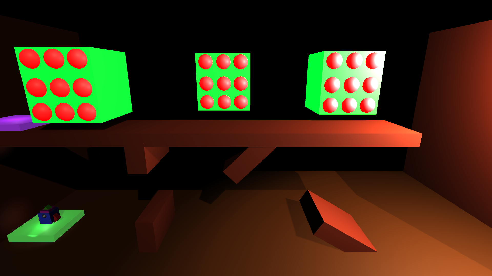

# Multi Level Rocket Game

A simple game where you have to fly a rocket ship from point A to point B to win. This was created within the Unity game engine using C# scripts to control the functionality of the collisions, obstacles, and rocket. This game furthered my knowledge on Unity and game development overall and taught me how to incorporate multiple levels within a game. To see the game files and demo the game, please visit this link: https://drive.google.com/file/d/1djLgBz0HDjQAGgbRC3xXKfdw6jbiAf5F/view?usp=sharing

# References
I created this game from one of my courses on GameDev.tv with professor Rick Davidson.
